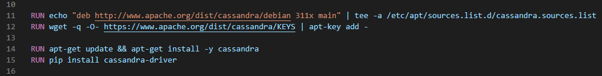

# DevOps-2022-Project
Making config for the docker image file to run the docker container.

## Overview
This project contains a docker image that installs packages that require for studying big bata engineering with python subject with a lecturer Kholed Langsari. Due to not having enough understanding of the student to configure and install some software. So, I got advice from the lecturer to make this project by making a docker image that everyone can use to install every software needed for the subject automatically and all the instructions needed. In this repo, it will consist of
- Dockerfile
- Demo.ipynb  | For demonstrating the function of the docker
- extensions as folder | For adding extensions to the attached Virtual Studio Code with the docker container

## Tools of use for demonstration
- Docker Desktop
- Virtual Studio Code
- any web browser
- CMD or Terminal

## Packages installed.
- Python
- Numpy
- Pandas
- Jupyter
- IPython
- Git
- PostgreSQL
- Apache Cassandra
- Apache Spark
- PySpark
- Kafka
- Apache Airflow
- etc.

##  Method to create dockerfile
**1. Use the official Anaconda image as the base image, Anaconda is a distribution of Python, then Set the working directory to /**

  

**2. Install the required dependencies, and packages using apt-get**

  

other choice for dependencies "curl, software-properties-common"
the command -y is mean that whenever the installation asks yes or no it will always answer yes

Git is a version control system, and to check the version or is it installed type this via Jupyter Nootbook
`!git --version`

GitHub is online version control, that can use by creating a repo on the GitHub website and link the git on the host with GitHub.

`git remote add origin https://github.com/your-username/your-repo-name.git`

GnuPG is an OpenPGP standard for encrypting and signing data, and to check the version or is it installed type this via Jupyter Nootbook
`!gpg --version`
due to errors such as ".gpg" when trying to install some packages so install GnuPG beforehand, and it will be fixed

PostgreSQL is object-relational database management system (ORDBMS), and to check the version or is it installed type this via Jupyter Nootbook
`!psql --version`

**3. Install the required packages using conda**

  

other choice for packages "statsmodels, matplotlib, seaborn"

Jupyter is an open-source web-based platform for interactive computing, using by run this in CMD or Terminal `jupyter lab --port=xxxx --ip=0.0.0.0 --no-browser --allow-root`
Make sure that the port of jupyter lab --port=xxxx free and match the port of Docker when first run `docker run -it -p xxxx:xxxx --name <containerName> <imageName>`
To check the version type this via Jupyter Nootbook
`!jupyter --version`

NumPy is a Python library, and to check the version or is it installed type this via Jupyter Nootbook
`!python -c "import numpy; print(numpy.__version__)"`

Pandas is a Python library, and to check the version or is it installed type this via Jupyter Nootbook
`!python -c "import pandas; print(pandas.__version__)"`

IPython is an enhanced interactive Python, and to check the version or is it installed type this via Jupyter Nootbook
`!ipython --version`

Psycopg2 is a Python library that provides a Python interface for the PostgreSQL database, and to check the version or is it installed type this via Jupyter Nootbook
`!pip show psycopg2`

**4. Install findspark using pip**

  

Findspark for pyspark to use in jupyter nootbook, and to check the version or is it installed type this via Jupyter Nootbook
`!pip show findspark`

**5. Install Apache Cassandra**

  

It needed a location file and GnuPG, Wget dependency, then it needed to update, then use apt-get and pip to install Apache Cassandra

**6. Install Apache Airflow**

  

Install it by using pip

**7. Install Kafka**

  

Install it by using Wget and extract the file to /opt/kafka then set the PATH so that it can use in the bin. Then, install Kafka-Python using pip for kafka to use in jupyter nootbook

**8. Bring file to container and set default command**

  

Copy the rest of the file in the folder to the image. Set the default command to run when starting the container, and command for run Jupyter Notebook type this
`jupyter notebook --ip=0.0.0.0 --port=8888 --no-browser --allow-root`

**9. Build image**

  

Put name after -t it will take some time depending on your speed of PC and internet

For building image if you create the same image.

`docker build -t big-data-engineering-with-python`

If you want to pull my image you can use.

`docker pull mylubnan/big-data-engineering-with-python:1.0`

**10. Run docker container**

  

After -p is the port I use to map from the host to the docker container, -p 8888:8888 for Jupyter Notebook, -p 0002:8080 for web server, -p 0003:5432 for PostgreSQL database
After --name is the name of the docker container follow with docker image name

---

For Visual Studio Code due to being unable to open VS code inside docker so I decide to use VS code outside but access through VS code extension called Dev Containers by doing so we can use VS code locally and then remotely edit and build the code inside the docker so there will no longer be a problem called "code work ok on my pc I do not know why it does not work on yours"

  

**To activate VS Code that remote with the inside docker.**

Firstly, download VS Code on the host machine. Then, download the Dev Containers extension. After that, there will be a button on the most bottom left called "Open a Remote Window". when clicking on it it will show many options, choose "Attach to Running Container" if your container already running it will show, if not make sure to start your container before this step. Then, it will load the docker and attach VS Code remote inside the docker.

  

##  Method to demonstrate

**1. Jupyter Notebook activation**

  

``jupyter notebook --ip=0.0.0.0 --port=8888 --no-browser --allow-root``

Activate Jupyter Notebook into port 8888 that was mapping the port of 8888 from the host to the container when I was running the container, and make sure to take the token after running Jupyter it appears after the run is done check the result it says token=xxxxxxxxxxxxxxxx just in case it needs to use

  

Now open `http://localhost:8888/lab` or `http://127.0.0.1:8888/lab`

  

Then open file named Demo.ipynb or `http://127.0.0.1:8888/lab/tree/Demo.ipynb`

  

**2. Check installation**
You sholde see something like these, it means everything installed successfully

  

  

**3. Demo PostgreSQL**
Run it step by step 
* To use it run `service postgresql start` 
* To check that is it ready run `pg_isready` 
* To connect to the PostgreSQL server run `psql -h localhost -U postgres`

  

If you get the same error do not worry I got the solution. So, If you could not find the password, to reset it go to Terminal and run 

`su - postgres`

then `psql -c "ALTER USER postgres PASSWORD '<NewPassword>';"` at <NewPassword> replace with the desired password, then `exit` and try `psql -h localhost -U postgres` again but this time enter the <NewPassword>
* To stop postgresql run `service postgresql stop`

  

Re-run and now you probably see the new error this error shows that it did not have the database yet so you can go create and use PostgreSQL as you please

  

**4. Demo Apache Airflow**
Run it step by step 
* To start web service of Apache Airflow `airflow webserver -p 8080` 
* Also run `airflow scheduler` for monitoring and managing
Then you will see theses running

  

  

  

  

  

Now you can use `http://localhost:2` or `http://127.0.0.1:2` because it already mapping host port which is 0002 to docker port which is 8080. If you do not see this Sign In page I recommend running `airflow webserver -p 8080` again and pressing Y on the keyboard within 4 seconds. 
After you get to the sign in page first you need to create user account as admin role run this `airflow users create -r Admin -u admin -e admin@example.com -f Admin -l User -p admin` Then you can use

* username: admin
* password: admin

  

Then sign in and see the below page and yes you can now use it as you please

  

## Author
- Lubnan Samae

# Link to Docker Hub
## https://hub.docker.com/r/mylubnan/big-data-engineering-with-python
